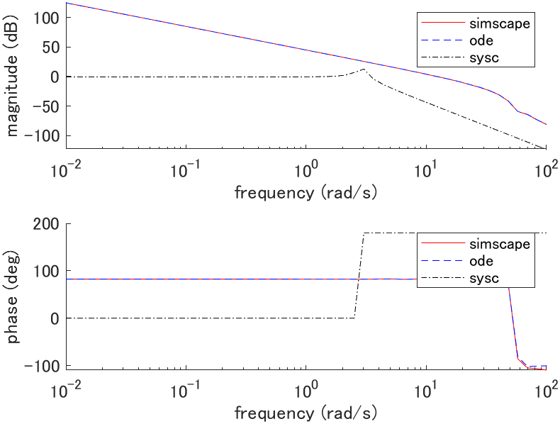

# Ball & beam

## System equations

Derive system equation with Lagrangian mechanics.

### Kinetic energy

```math
\begin{aligned}
K &= \frac{1}{2} m \dot{q}^2(t) + \frac{1}{2} m q^2(t) \dot{\theta}^2(t) + \frac{1}{2} \frac{J}{r^2} \dot{q}^2(t) \\

&= \frac{1}{2} \left\{
\left[ m + \frac{J}{r^2} \right] \dot{q}^2(t) + m q^2(t) \dot{\theta}^2(t)
\right\}
\end{aligned}
```

### Potential energy

```math
U = m g q(t) \sin(\theta(t))
```

### Derive equation of motion

#### Lagrangian

```math
L = K - U
```

#### Euler-Lagrange equation

```math
\begin{cases}
\displaystyle \frac{d}{dt} \left( \frac{d L}{d \dot{q}} \right) - \frac{dL}{dq} = 0 \\

\displaystyle \frac{d}{dt} \left( \frac{d L}{d \dot{\theta}} \right) - \frac{dL}{d \theta} = \tau(t)
\end{cases}
```

#### Equation of motion

```math
\begin{cases}
[m + \frac{J}{r^2}] \ddot{q}(t) - m q(t) \dot{\theta}^2(t) + m g \sin(\theta(t)) = 0 \\

m q^2(t) \ddot{\theta}(t) + 2 m q(t) \dot{q}(t) \dot{\theta}(t) + m g q(t) \cos(\theta(t)) = \tau(t)
\end{cases}
```

| Description | Symbol and unit |
|-|-|
| ball position | $`q \mathrm{[m]}`$ |
| beam angle | $`\theta \mathrm{[rad]}`$ |
| torque on beam | $`\tau \mathrm{[N \cdot m]}`$ |
| gravitational acceleration | $`g \mathrm{[m/s^2]}`$ |
| ball mass | $`m \mathrm{[kg]}`$ |
| ball moment of inertia | $`J \mathrm{[kg \cdot m^2]}`$ |
| ball radius | $`r \mathrm{[m]}`$ |

## State space equation (plant_ode.m)

```math
\frac{d}{dt} \left[ \begin{array}{c}
q(t) \\ \theta(t) \\ \dot{q}(t) \\ \dot{\theta}(t)
\end{array} \right]
=
\left[ \begin{array}{c}
\dot{q}(t) \\
\dot{\theta}(t) \\
\frac{m}{m + \frac{J}{r^2}} q(t) \dot{\theta}^2(t) - \frac{m g}{m + \frac{J}{r^2}} \sin(\theta(t)) \\
-\frac{2}{q(t)} \dot{q}(t) \dot{\theta}(t) - \frac{g}{q(t)} \cos(\theta(t)) + \frac{1}{m q^2(t)} \tau(t)
\end{array} \right]
=:
f(x(t), u(t))
```

## Linear state space equation (plant_sysc.m)

### Equilibrium point

The equilibrium point satisfies $`f(x_e, u_e) = 0`$ thus,

```math
\begin{cases}
\dot{q}_e = 0 \\
\dot{\theta}_e = 0 \\
\sin(\theta_e) = 0 \Rightarrow \theta_e = 0 \\
\tau_e = m g q_e
\end{cases}
```

where $`q_e`$ is arbitrary.

### Linear state space equation

```math
\frac{d}{dt} \left[ \begin{array}{c}
q(t) \\ \theta(t) \\ \dot{q}(t) \\ \dot{\theta}(t)
\end{array} \right]
=
\left[ \begin{array}{cc}
0 & 0 & 1 & 0 \\
0 & 0 & 0 & 1 \\
0 & -\frac{m g}{m + \frac{J}{r^2}} & 0 & 0 \\
-\frac{g}{q_e^2} & 0 & 0 & 0
\end{array} \right]

\left[ \begin{array}{c}
q(t) \\ \theta(t) \\ \dot{q}(t) \\ \dot{\theta}(t)
\end{array} \right]
+
\left[ \begin{array}{c}
0 \\ 0 \\ 0 \\ \frac{1}{m q_e^2}
\end{array} \right]

\left[ \begin{array}{c}
\tau(t)
\end{array} \right]
```

## Simscape (plant_simscape.slx)


## Simulation

### Parameters (plant_param.m)

| Parameter | Value |
|-|-|
| $`g \mathrm{[m/s^2]}`$ | $`9.8`$ |
| $`m \mathrm{[kg]}`$ | $`0.11`$ |
| $`J \mathrm{[kg \cdot m^2]}`$ | $`9.99 \times 10^{-6}`$ |
| $`r \mathrm{[m]}`$ | $`0.015`$ |

### Initial state response (plot_initial.m)


where $`x(0) = [1, \frac{\pi}{12}, 0, 0]^T`$, $`x_e = [1, 0, 0, 0]^T`$, $`u_e = [1.078]^T`$.

### Impulse response (plot_impulse.m)


where $`x_e = [1, 0, 0, 0]^T`$, $`u_e = [1.078]^T`$.

### Bode plot (plot_bode.m)



where $`G_1(s) = Q(s)/T(s)`$, $`x_e = [1, 0, 0, 0]^T`$, $`u_e = [1.078]^T`$.


where $`G_2(s) = \Theta(s)/T(s)`$, $`x_e = [1, 0, 0, 0]^T`$, $`u_e = [1.078]^T`$.
