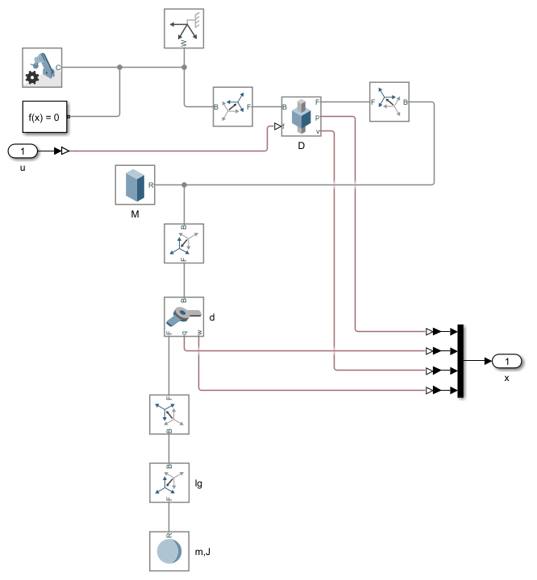
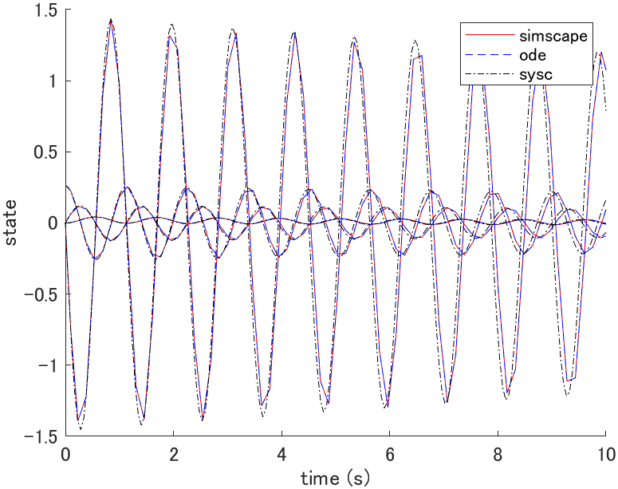
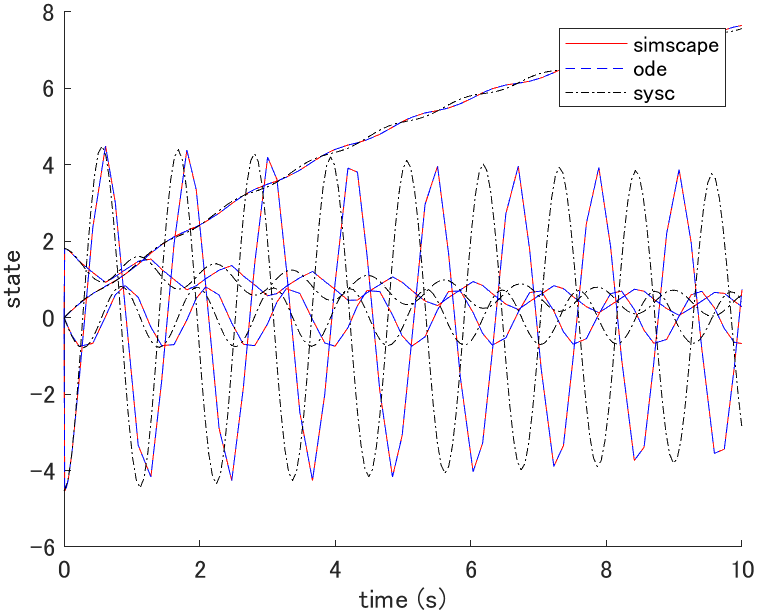
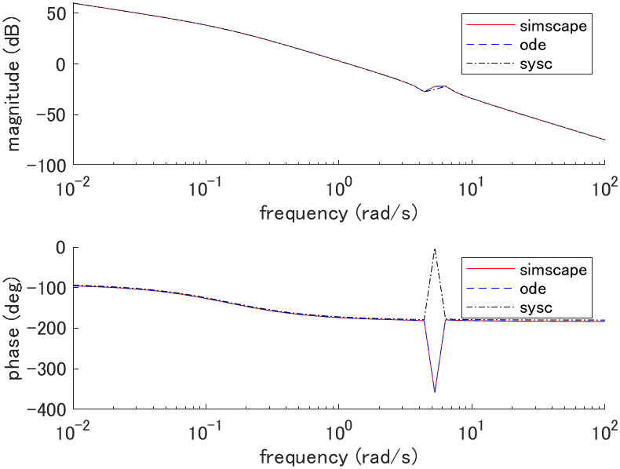
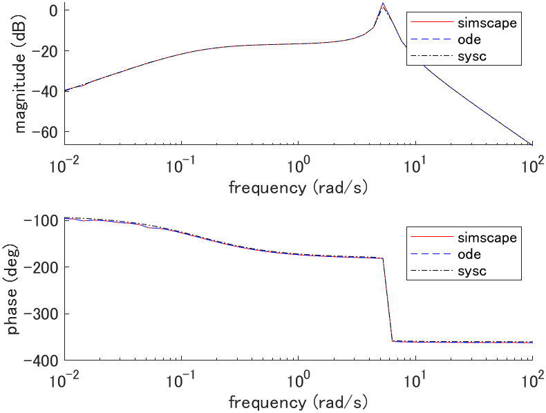

# Cart pole

## System equations (eom.mlx)

Derive system equation with Lagrangian mechanics.

Define the position vector $`p_c, p_p`$ and velociry vector $`v_c, v_p`$.

```math
\begin{aligned}
p_c(t) &= \left[ \begin{array}{c}
q(t) \\ 0
\end{array} \right] \\

p_p(t) &= \left[ \begin{array}{c}
q(t) + l_g \sin(\theta(t)) \\
-l_g \cos(\theta(t))
\end{array} \right] \\

v_c(t) &= \left[ \begin{array}{c}
\dot{q}(t) \\ 0
\end{array} \right] \\

v_p(t) &= \left[ \begin{array}{c}
\dot{q}(t) + l_g \dot{\theta}(t) \cos(\theta(t)) \\
l_g \dot{\theta}(t) \sin(\theta(t))
\end{array} \right]
\end{aligned}
```

### Kinetic energy

```math
\begin{aligned}
K &= \frac{1}{2} M v_c^T(t) v_c(t) + \frac{1}{2} m v_p^T(t) v_p(t) + \frac{1}{2} J \dot{\theta}^2(t) \\

&= \frac{1}{2} \left\{
M \dot{q}^2(t)
+ m [\dot{q}^2(t) + 2 l_g \dot{q}(t) \dot{\theta}(t) \cos(\theta(t)) + l_g^2 \dot{\theta}^2(t) \cos^2(\theta(t)) + l_g^2 \dot{\theta}^2(t) \sin^2(\theta(t))] 
+ J \dot{\theta}^2(t)
\right\} \\

&= \frac{1}{2} \left\{
[M + m] \dot{q}^2(t) + 2 m l_g \dot{q}(t) \dot{\theta}(t) \cos(\theta(t)) + [m l_g^2 + J] \dot{\theta}^2(t)
\right\}
\end{aligned}
```

### Potential energy

```math
U = -m l_g g \cos(\theta(t))
```

### Dissipation energy

```math
F = \frac{1}{2} \left\{
D \dot{q}^2(t) + d \dot{\theta}(t)
\right\}
```

### Derive equation of motion

#### Lagrangian

```math
L = K - U
```

#### Euler-Lagrange equation

```math
\begin{cases}
\displaystyle \frac{d}{dt} \left( \frac{d L}{d \dot{q}} \right) - \frac{dL}{dq} + \frac{dF}{d \dot{q}} = f(t) \\

\displaystyle \frac{d}{dt} \left( \frac{d L}{d \dot{\theta}} \right) - \frac{dL}{d \theta} + \frac{dF}{d \dot{\theta}} = 0
\end{cases}
```

#### Equation of motion

```math
\begin{cases}
[M + m] \ddot{q}(t) + m l_g \ddot{\theta}(t) \cos(\theta(t)) - m l_g \dot{\theta}^2(t) \sin(\theta(t)) + D \dot{q}(t) = f(t) \\

m l_g \ddot{q}(t) \cos(\theta(t)) + [m l_g^2 + J] \ddot{\theta}(t) + m l_g g \sin(\theta(t)) + d \dot{\theta}^2(t) = 0
\end{cases}
```

In matrix form,

```math
\underbrace{
\left[ \begin{array}{cc}
M + m & m l_g \cos(\theta(t)) \\
m l_g \cos(\theta(t)) & m l_g^2 + J
\end{array} \right]
}_{\mathbf{M}}

\left[ \begin{array}{c}
\ddot{q}(t) \\ \ddot{\theta}(t)
\end{array} \right]
+
\underbrace{
\left[ \begin{array}{cc}
D & 0 \\
0 & d
\end{array} \right]

\left[ \begin{array}{c}
\dot{q}(t) \\ \dot{\theta}(t)
\end{array} \right]
}_{\mathbf {D}}
+
\underbrace{
\left[ \begin{array}{c}
-m l_g \dot{\theta}^2(t) \sin(\theta(t)) \\
m l_g g \sin(\theta(t))
\end{array} \right]
}_{\mathbf{C}}
=
\underbrace{
\left[ \begin{array}{c}
f(t) \\ 0
\end{array} \right]
}_{\mathbf{U}}
```

| Description | Symbol and unit |
|-|-|
| cart position | $`q \mathrm{[m]}`$ |
| pendulum angle | $`\theta \mathrm{[rad]}`$ |
| force on cart | $`f \mathrm{[N]}`$ |
| gravitational acceleration | $`g \mathrm{[m/s^2]}`$ |
| cart mass | $`M \mathrm{[kg]}`$ |
| cart damping coefficient | $`D \mathrm{[N \cdot s/m]}`$ |
| pendulum mass | $`m \mathrm{[kg]}`$ |
| pendulum damping coefficient | $`d \mathrm{[N \cdot s/m]}`$ |
| pendulum moment of inertia | $`J \mathrm{[kg \cdot m^2]}`$ |
| length from cart to pendulum centor of gravity | $`l_g \mathrm{[m]}`$ |

## State space equation (plant_ode.m)

```math
\frac{d}{dt} \left[ \begin{array}{c}
q(t) \\ \theta(t) \\ \dot{q}(t) \\ \dot{\theta}(t)
\end{array} \right]
=
\left[ \begin{array}{c}
\dot{q}(t) \\
\dot{\theta}(t) \\
-\mathbf{M}^{-1} \mathbf{D} - \mathbf{M}^{-1} \mathbf{C} + \mathbf{M}^{-1} \mathbf{U}
\end{array} \right]
=:
f(x(t), u(t))
```

## Linear state space equation (plant_sysc.m)

### Equilibrium point

The equilibrium point satisfies $`f(x_e, u_e) = 0`$ thus,

```math
\begin{cases}
\dot{q}_e = 0 \\
\dot{\theta}_e = 0 \\
[m l_g^2 + J] f_e = m^2 l_g^2 g \sin(\theta_e) \cos(\theta_e) \\
\cos(\theta_e) f_e + [M + m] g \sin(\theta_e) = 0
\end{cases}
```

Assuming $`f_e = 0`$, we have $`\theta_e = n \pi ~(n \in \mathbb{Z})`$ and arbitrary $`q_e`$.

### Linear state space equation

```math
\frac{d}{dt} \left[ \begin{array}{c}
q(t) \\ \theta(t) \\ \dot{q}(t) \\ \dot{\theta}(t)
\end{array} \right]
=
\left[ \begin{array}{cccc}
0 & 0 & 1 & 0 \\
0 & 0 & 0 & 1 \\
0 & \frac{m^2 l_g^2 g}{\sigma} & -\frac{[m l_g^2 + J] D}{\sigma} & \frac{m l_g d}{\sigma} \\
0 & -\frac{[M + m] m l_g g}{\sigma} & \frac{m l_g D}{\sigma} & -\frac{[M + m] d}{\sigma}
\end{array} \right]

\left[ \begin{array}{c}
q(t) \\ \theta(t) \\ \dot{q}(t) \\ \dot{\theta}(t)
\end{array} \right]
+
\left[ \begin{array}{c}
0 \\
0 \\
\frac{m l_g^2 + J}{\sigma} \\
-\frac{m l_g}{\sigma}
\end{array} \right]

\left[ \begin{array}{c}
f(t)
\end{array} \right],

~~~\sigma = [M + m] J + M m l_g^2
```

where $`x_e = [0, 0, 0, 0]^T`$, $`u_e = [0]^T`$ (pendulum is at bottom).

```math
\frac{d}{dt} \left[ \begin{array}{c}
q(t) \\ \theta(t) \\ \dot{q}(t) \\ \dot{\theta}(t)
\end{array} \right]
=
\left[ \begin{array}{cccc}
0 & 0 & 1 & 0 \\
0 & 0 & 0 & 1 \\
0 & \frac{m^2 l_g^2 g}{\sigma} & -\frac{[m l_g^2 + J] D}{\sigma} & -\frac{m l_g d}{\sigma} \\
0 & \frac{[M + m] m l_g g}{\sigma} & -\frac{m l_g D}{\sigma} & -\frac{[M + m] d}{\sigma}
\end{array} \right]

\left[ \begin{array}{c}
q(t) \\ \theta(t) \\ \dot{q}(t) \\ \dot{\theta}(t)
\end{array} \right]
+
\left[ \begin{array}{c}
0 \\
0 \\
\frac{m l_g^2 + J}{\sigma} \\
\frac{m l_g}{\sigma}
\end{array} \right]

\left[ \begin{array}{c}
f(t)
\end{array} \right],

~~~\sigma = [M + m] J + M m l_g^2
```

where $`x_e = [0, \pi, 0, 0]^T`$, $`u_e = [0]^T`$ (pendulum is at top).

## Simscape (plant_simscape.slx)



## Simulation

### Parameters (plant_param.m)

| Parameter | Value |
|-|-|
| $`g \mathrm{[m/s^2]}`$ | $`9.8`$ |
| $`M \mathrm{[kg]}`$ | $`0.5`$ |
| $`D \mathrm{[N \cdot s/m]}`$ | $`0.1`$ |
| $`m \mathrm{[kg]}`$ | $`0.2`$ |
| $`d \mathrm{[N \cdot s/m]}`$ | $`0.0`$ |
| $`J \mathrm{[kg \cdot m^2]}`$ | $`0.006`$ |
| $`l_g \mathrm{[m]}`$ | $`0.3`$ |

### Initial state response (plot_initial.m)



where $`x(0) = [0, \frac{\pi}{12}, 0, 0]^T`$, $`x_e = [0, 0, 0, 0]^T`$, $`u_e = [0]^T`$.

### Impulse response (plot_impulse.m)



where $`x_e = [0, 0, 0, 0]^T`$, $`u_e = [0]^T`$.

### Bode plot (plot_bode.m)



where $`G_1(s) = Q(s)/F(s)`$, $`x_e = [0, 0, 0, 0]^T`$, $`u_e = [0]^T`$.



where $`G_2(s) = \Theta(s)/F(s)`$, $`x_e = [0, 0, 0, 0]^T`$, $`u_e = [0]^T`$.
