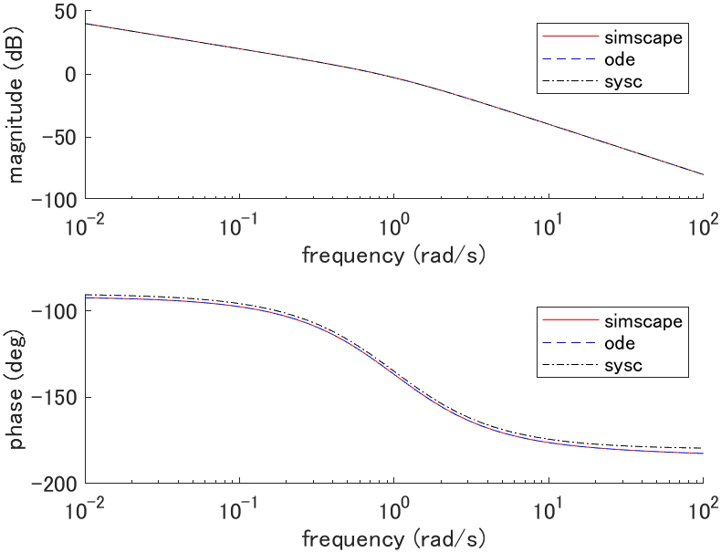

# Mass damper

## System equations

```math
m \ddot{q}(t) + d \dot{q}(t) = f(t)
```

| Description | Symbol and unit |
|-|-|
| position | $`q \mathrm{[m]}`$ |
| force | $`f \mathrm{[N]}`$ |
| mass | $`m \mathrm{[kg]}`$ |
| damping coefficient | $`d \mathrm{[N \cdot s/m]}`$ |

## State space equation (plant_ode.m)

```math
\frac{d}{dt} \left[ \begin{array}{c}
q(t) \\ \dot{q}(t)
\end{array} \right]
=
\left[ \begin{array}{c}
\dot{q}(t) \\
-\frac{d}{m} \dot{q}(t) + \frac{1}{m} f(t)
\end{array} \right]
=:
f(x(t), u(t))
```

## Linear state space equation (plant_sysc.m)

### Equilibrium point

The equilibrium point satisfies $`f(x_e, u_e) = 0`$ thus,

```math
\begin{cases}
\dot{q}_e = 0 \\
f_e = 0
\end{cases}
```

where $`q_e`$ is arbitrary.

### Linear state space equation

```math
\frac{d}{dt} \left[ \begin{array}{c}
q(t) \\ \dot{q}(t)
\end{array} \right]
=
\left[ \begin{array}{cc}
0 & 1 \\
0 & -\frac{d}{m}
\end{array} \right]

\left[ \begin{array}{c}
q(t) \\ \dot{q}(t)
\end{array} \right]
+
\left[ \begin{array}{c}
0 \\ \frac{1}{m}
\end{array} \right]

\left[ \begin{array}{c}
f(t)
\end{array} \right]
```

## Simscape (plant_simscape.slx)


## Simulation

### Parameters (plant_param.m)

| Parameter | Value |
|-|-|
| $`m \mathrm{[kg]}`$ | $`1.0`$ |
| $`d \mathrm{[N \cdot s/m]}`$ | $`1.0`$ |

### Initial state response (plot_initial.m)


where $`x(0) = [0, 1]^T`$, $`x_e = [0, 0]^T`$, $`u_e = [0]^T`$.

### Impulse response (plot_impulse.m)


where $`x_e = [0, 0]^T`$, $`u_e = [0]^T`$.

### Bode plot (plot_bode.m)



where $`G(s) = Q(s)/F(s)`$, $`x_e = [0, 0]^T`$, $`u_e = [0]^T`$.
