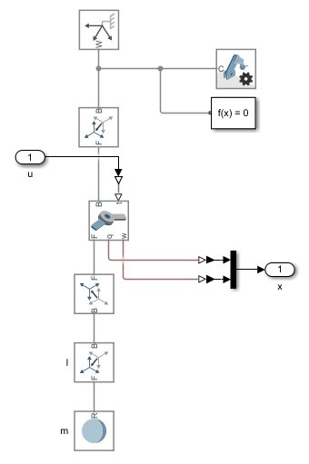
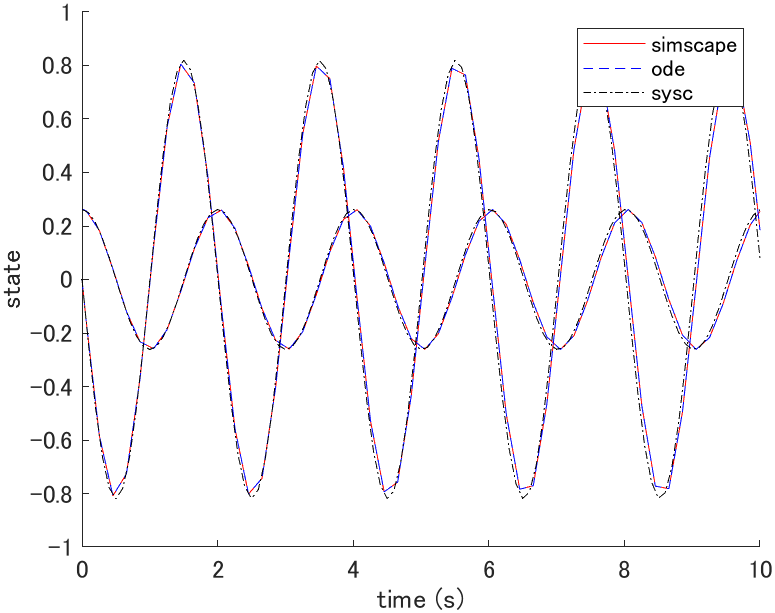
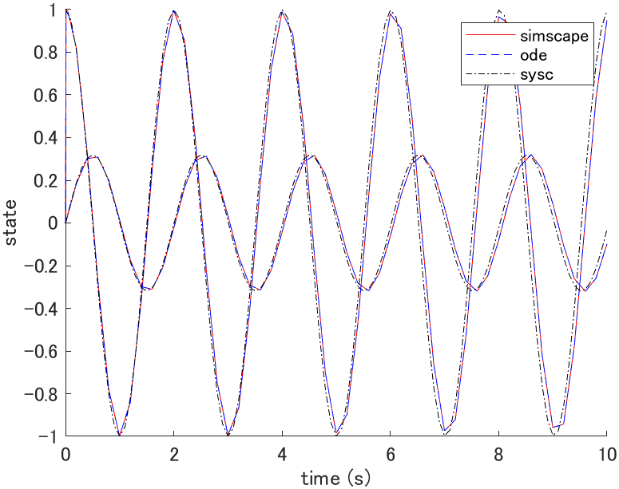
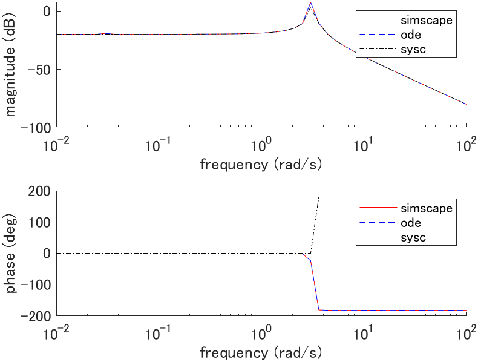

# Pendulum

## System equations

```math
m l^2 \ddot{\theta}(t) + m l g \sin(\theta(t)) = \tau(t)
```

| Description | Symbol and unit |
|-|-|
| angle | $`\theta \mathrm{[rad]}`$ |
| torque | $`\tau \mathrm{[N \cdot m]}`$ |
| gravitational acceleration | $`g \mathrm{[m/s^2]}`$ |
| mass | $`m \mathrm{[kg]}`$ |
| length | $`l \mathrm{[m]}`$ |

## State space equation (plant_ode.m)

```math
\frac{d}{dt} \left[ \begin{array}{c}
\theta(t) \\ \dot{\theta}(t)
\end{array} \right]
=
\left[ \begin{array}{c}
\dot{\theta}(t) \\
-\frac{g}{l} \sin(\theta(t)) + \frac{1}{m l^2} \tau(t)
\end{array} \right]
=:
f(x(t), u(t))
```

## Linear state space equation (plant_sysc.m)

### Equilibrium point

The equilibrium point satisfies $`f(x_e, u_e) = 0`$ thus,

```math
\begin{cases}
\dot{\theta}_e = 0 \\
\tau_e = m l g \sin(\theta_e)
\end{cases}
```

where $`\theta_e`$ is arbitrary.

### Linear state space equation

```math
\frac{d}{dt} \left[ \begin{array}{c}
\theta(t) \\ \dot{\theta}(t)
\end{array} \right]
=
\left[ \begin{array}{cc}
0 & 1 \\
-\frac{g}{l} \cos(\theta_e) & 0
\end{array} \right]

\left[ \begin{array}{c}
\theta(t) \\ \dot{\theta}(t)
\end{array} \right]
+
\left[ \begin{array}{c}
0 \\ \frac{1}{m l^2}
\end{array} \right]

\left[ \begin{array}{c}
\tau(t)
\end{array} \right]
```

## Simscape (plant_simscape.slx)



## Simulation

### Parameters (plant_param.m)

| Parameter | Value |
|-|-|
| $`g \mathrm{[m/s^2]}`$ | $`9.81`$ |
| $`m \mathrm{[kg]}`$ | $`1.0`$ |
| $`l \mathrm{[m]}`$ | $`1.0`$ |

### Initial state response (plot_initial.m)



where $`x(0) = [\frac{\pi}{12}, 0]^T`$, $`x_e = [0, 0]^T`$, $`u_e = [0]^T`$.

### Impulse response (plot_impulse.m)



where $`x_e = [0, 0]^T`$, $`u_e = [0]^T`$.

### Bode plot (plot_bode.m)



where $`G(s) = \Theta(s)/T(s)`$, $`x_e = [0, 0]^T`$, $`u_e = [0]^T`$.
