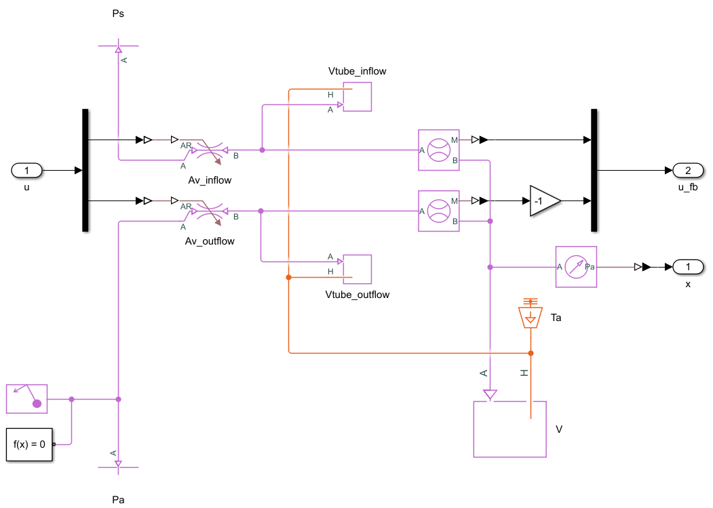
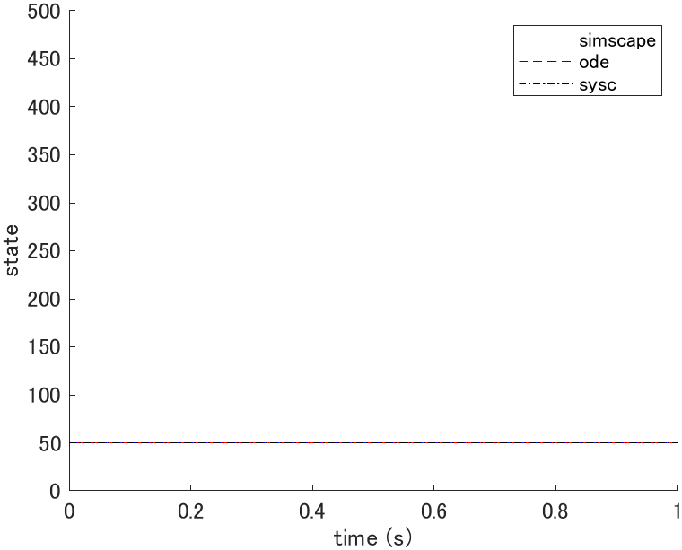
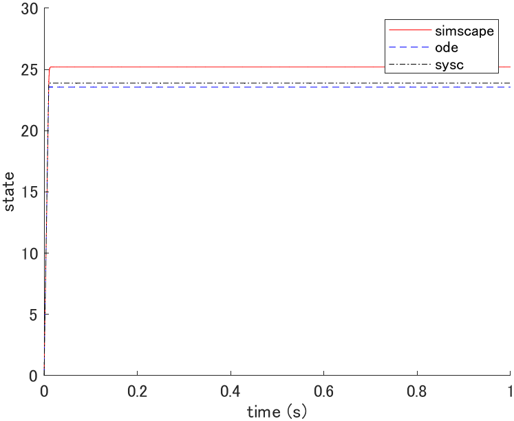
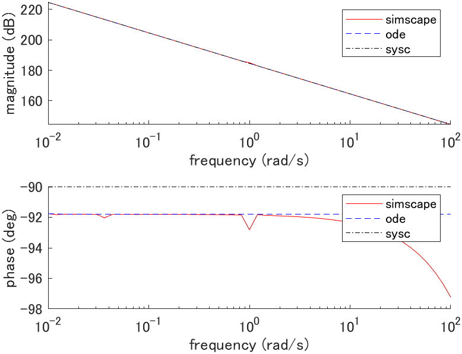

# Pneumatic chamber

## System equations

Derived from the equation of state of an ideal gas under the following assumptions:

- Ideal gas
- Quasi-static process
- Chamber pressure and temperature are uniform (lumped parameter system)
- Kinetic and potential energy of a gas can be neglected

### Case $`P(t) \lt P_a`$

```math
\dot{P}(t) = \frac{R T_a}{V} \left[ \alpha_{in} \dot{m}_{in}(t) - \alpha_{in} \dot{m}_{out}(t) \right]
```

```math
\mathrm{s.t.~~~} \begin{cases}
0 \leq \dot{m}_{in}(t) \leq \psi(P_s, P(t)) \\
\psi(P(t), P_a) \leq \dot{m}_{out}(t) \leq 0
\end{cases}
```

### Case $`P_a \leq P(t) \lt P_s`$

```math
\dot{P}(t) = \frac{R T_a}{V} \left[ \alpha_{in} \dot{m}_{in}(t) - \alpha_{out} \dot{m}_{out}(t) \right]
```

```math
\mathrm{s.t.~~~} \begin{cases}
0 \leq \dot{m}_{in}(t) \leq \psi(P_s, P(t)) \\
0 \leq \dot{m}_{out}(t) \leq \psi(P(t), P_a)
\end{cases}
```

### Case $`P_s \leq P(t)`$

```math
\dot{P}(t) = \frac{R T_a}{V} \left[ \alpha_{out} \dot{m}_{in}(t) - \alpha_{out} \dot{m}_{out}(t) \right]
```

```math
\mathrm{s.t.~~~} \begin{cases}
\psi(P_s, P(t)) \leq \dot{m}_{in}(t) \leq 0 \\
0 \leq \dot{m}_{out}(t) \leq \psi(P(t), P_a)
\end{cases}
```

where,

```math
\psi(P_1(t), P_2(t)) = \begin{cases}
C_1 A_v \frac{P_1(t)}{\sqrt{R T_a}},
& \left( 0 \leq \frac{P_2(t)}{P_1(t)} \lt P_{cr} \right) \\

C_2 A_v \frac{P_1(t)}{\sqrt{R T_a}} \left( \frac{P_2(t)}{P_1(t)} \right)^{\frac{1}{\kappa}} \sqrt{1 - \left( \frac{P_2(t)}{P_1(t)} \right)^{\frac{\kappa - 1}{\kappa}}},
& \left( P_{cr} \leq \frac{P_2(t)}{P_1(t)} \lt 1 \right) \\

-C_2 A_v \frac{P_2(t)}{\sqrt{R T_a}} \left( \frac{P_1(t)}{P_2(t)} \right)^{\frac{1}{\kappa}} \sqrt{1 - \left( \frac{P_1(t)}{P_2(t)} \right)^{\frac{\kappa - 1}{\kappa}}},
& \left( 1 \leq \frac{P_2(t)}{P_1(t)} \lt \frac{1}{P_{cr}} \right) \\

-C_1 A_v \frac{P_2(t)}{\sqrt{R T_a}},
& \left( \frac{1}{P_{cr}} \leq \frac{P_2(t)}{P_1(t)} \right)
\end{cases}
```

```math
C_1 = \sqrt{\kappa \left( \frac{2}{\kappa + 1} \right)^{\frac{\kappa + 1}{\kappa - 1}}},~~~
C_2 = \sqrt{\frac{2 \kappa}{\kappa - 1}},~~~
P_{cr} = \left( \frac{2}{\kappa + 1} \right)^{\frac{\kappa}{\kappa - 1}}
```

| Description | Symbol and unit |
|-|-|
| pressure | $`P \mathrm{[Pa]}`$ |
| mass flow of inflow | $`\dot{m}_{in} \mathrm{[kg/s]}`$ |
| mass flow of outflow | $`\dot{m}_{out} \mathrm{[kg/s]}`$ |
| specific gas constant | $`R \mathrm{[J/kg \cdot K]}`$ |
| heat capacity ratio | $`\kappa \mathrm{[-]}`$ |
| atmospheric temperature | $`T_a \mathrm{[K]}`$ |
| atmospheric pressure | $`P_a \mathrm{[Pa]}`$ |
| supply pressure | $`P_s \mathrm{[Pa]}`$ |
| cross-sectional area of valve | $`A_v \mathrm{[m^2]}`$ |
| polytropic coefficient of inflow | $`\alpha_{in} \mathrm{[-]}`$ |
| polytropic coefficient of outflow | $`\alpha_{out} \mathrm{[-]}`$ |
| chamber volume | $`V \mathrm{[m^3]}`$ |
| tube volume | $`V_{tube} \mathrm{[m^3]}`$ |

## State space equation (plant_ode.m)

```math
\frac{d}{dt} \left[ \begin{array}{c}
P(t)
\end{array} \right]
=
\left[ \begin{array}{c}
\frac{R T_a}{V} \mu(t)
\end{array} \right]
=:
f(x(t), u(t))
```

```math
\mu(t) = \begin{cases}
\alpha_{in} \dot{m}_{in}(t) - \alpha_{in} \dot{m}_{out}(t), & (P(t) \lt P_a) \\
\alpha_{in} \dot{m}_{in}(t) - \alpha_{out} \dot{m}_{out}(t), & (P_a \leq P(t) \lt P_s) \\
\alpha_{out} \dot{m}_{in}(t) - \alpha_{out} \dot{m}_{out}(t), & (P_s \lt P(t))
\end{cases}
```

## Linear state space equation (plant_sysc.m)

### Equilibrium point

The equilibrium point satisfies $`f(x_e, u_e) = 0`$ thus,

```math
\mu_e = 0
```

where $`P_e`$ is arbitrary.

### Linear state space equation

```math
\frac{d}{dt} \left[ \begin{array}{c}
P(t)
\end{array} \right]
=
\left[ \begin{array}{c}
0
\end{array} \right]

\left[ \begin{array}{c}
P(t)
\end{array} \right]
+
\left[ \begin{array}{c}
\frac{R T_a}{V}
\end{array} \right]

\left[ \begin{array}{c}
\mu(t)
\end{array} \right]
```

## Simscape (plant_simscape.slx)



## Simulation

### Parameters (plant_param.m)

| Parameter | Value |
|-|-|
| $`R \mathrm{[J/kg \cdot K]}`$ | $`287`$ |
| $`\kappa \mathrm{[-]}`$ | $`1.4`$ |
| $`T_a \mathrm{[K]}`$ | $`293.15`$ |
| $`P_a \mathrm{[Pa]}`$ | $`101.3 \times 10^3`$ |
| $`P_s \mathrm{[Pa]}`$ | $`500 \times 10^3 + P_a`$ |
| $`A_v \mathrm{[m^2]}`$ | $`1 \times 10^{-6}`$ |
| $`\alpha_{in} \mathrm{[-]}`$ | $`1.0`$ |
| $`\alpha_{out} \mathrm{[-]}`$ | $`1.0`$ |
| $`V \mathrm{[m^3]}`$ | $`50 \times 10^{-6}`$ |
| $`V_{tube} \mathrm{[m^3]}`$ | $`0.05 \times 10^{-6}`$ |

### Initial state response (plot_initial.m)



where $`x(0) = [50 \times 10^3]^T`$, $`x_e = [351.3 \times 10^3]^T`$, $`u_e = [0]^T`$.

### Impulse response (plot_impulse.m)



where $`x_e = [351.3 \times 10^3]^T`$, $`u_e = [0]^T`$.

### Bode plot (plot_bode.m)



where $`G(s) = P(s)/\mu(s)`$, $`x_e = [351.3 \times 10^3]^T`$, $`u_e = [0]^T`$.
