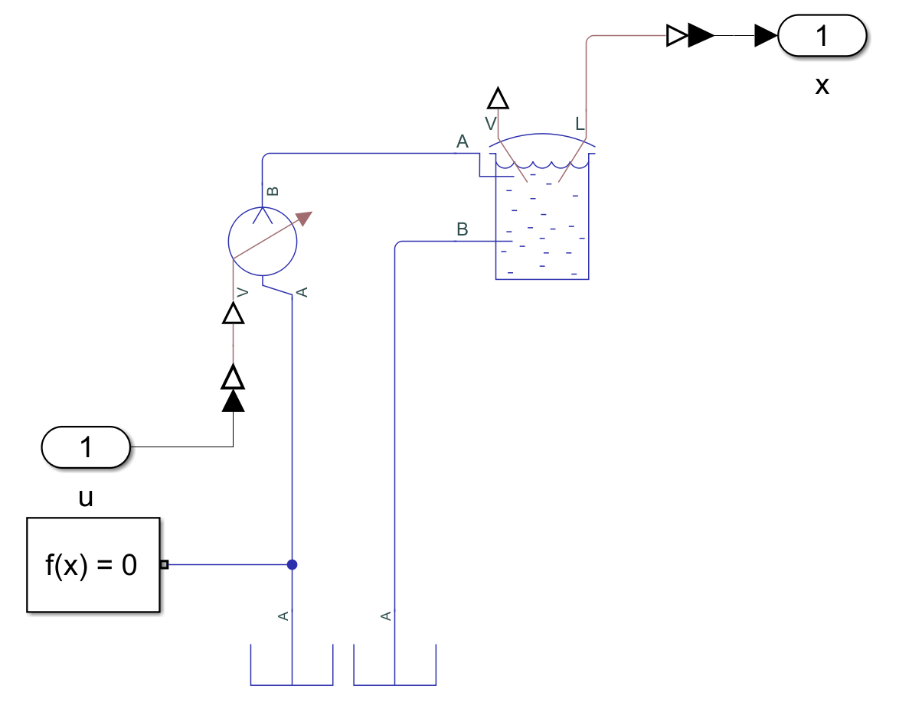
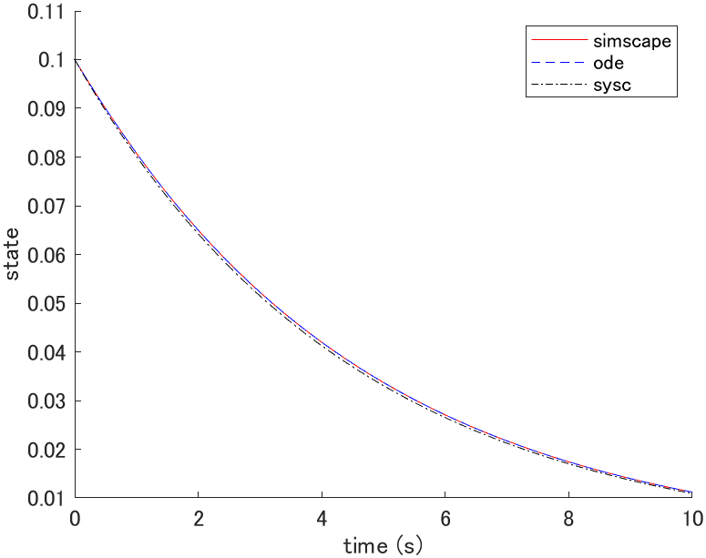
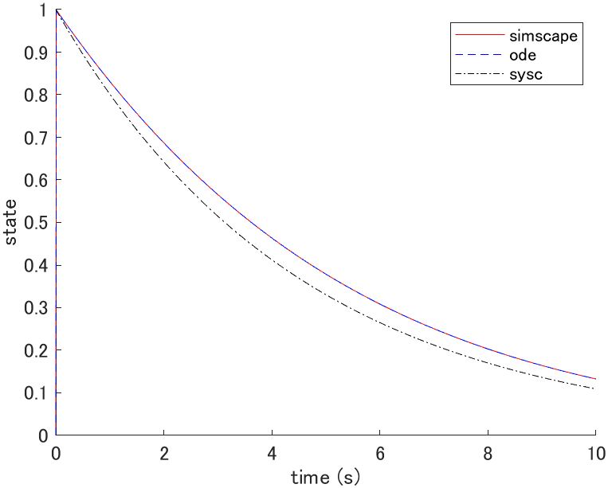
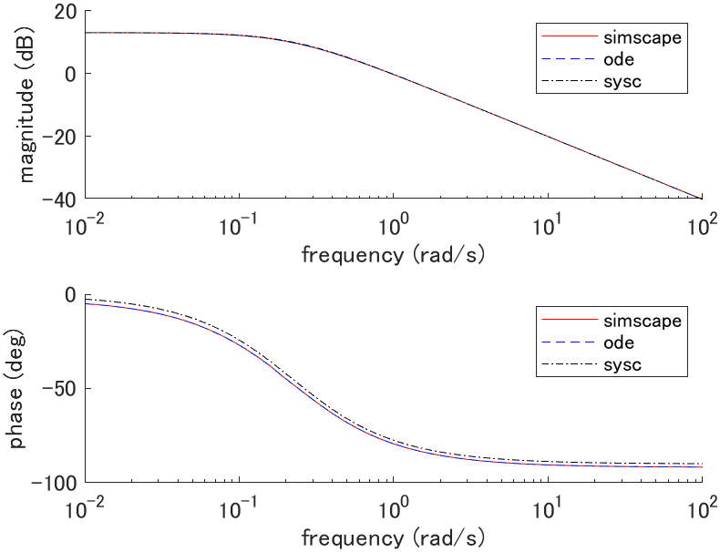

# Water tank

## System equations

```math
A \dot{z}(t) + a \sqrt{2 g z(t)} = q(t)
```

| Description | Symbol and unit |
|-|-|
| water level | $`z \mathrm{[m]}`$ |
| volume flow rate of inflow | $`q \mathrm{[m^3/s]}`$ |
| gravitational acceleration | $`g \mathrm{[m/s^2]}`$ |
| cross-sectional area of tank | $`A \mathrm{[m^2]}`$ |
| cross-sectional area of outflow | $`a \mathrm{[m^2]}`$ |

## State space equation (plant_ode.m)

```math
\frac{d}{dt} \left[ \begin{array}{c}
z(t)
\end{array} \right]
=
\left[ \begin{array}{c}
-\frac{a \sqrt{2 g}}{A} \sqrt{z(t)} + \frac{1}{A} q(t)
\end{array} \right]
=:
f(x(t), u(t))
```

## Linear state space equation (plant_sysc.m)

### Equilibrium point

The equilibrium point satisfies $`f(x_e, u_e) = 0`$ thus,

```math
a \sqrt{2 g z_e} = q_e
```

### Linear state space equation

```math
\frac{d}{dt} \left[ \begin{array}{c}
z(t)
\end{array} \right]
=
\left[ \begin{array}{c}
-\frac{a}{2 A} \sqrt{\frac{2 g}{z_e}}
\end{array} \right]

\left[ \begin{array}{c}
z(t)
\end{array} \right]
+
\left[ \begin{array}{c}
\frac{1}{A}
\end{array} \right]

\left[ \begin{array}{c}
q(t)
\end{array} \right]
```

## Simscape (plant_simscape.slx)



## Simulation

### Parameters (plant_param.m)

| Parameter | Value |
|-|-|
| $`g \mathrm{[m/s^2]}`$ | $`9.81`$ |
| $`A \mathrm{[m^2]}`$ | $`1.0`$ |
| $`a \mathrm{[m^2]}`$ | $`0.1`$ |

### Initial state response (plot_initial.m)



where $`x(0) = [1.1]^T`$, $`x_e = [1]^T`$, $`u_e = [0.4429]^T`$.

### Impulse response (plot_impulse.m)



where $`x_e = [1]^T`$, $`u_e = [0.4429]^T`$.

### Bode plot (plot_bode.m)



where $`G(s) = Z(s)/Q(s)`$, $`x_e = [1]^T`$, $`u_e = [0.4429]^T`$.
