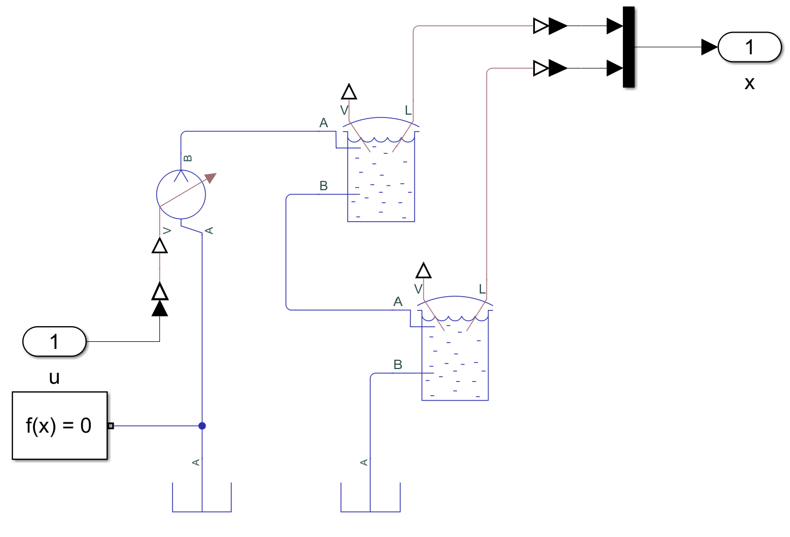
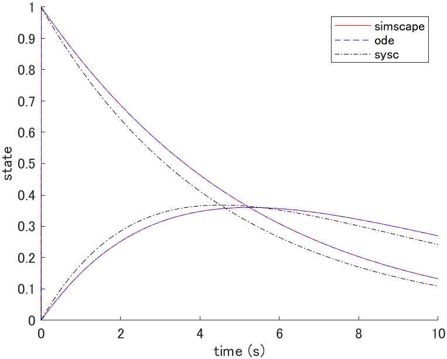
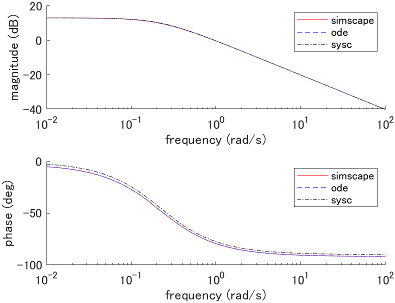
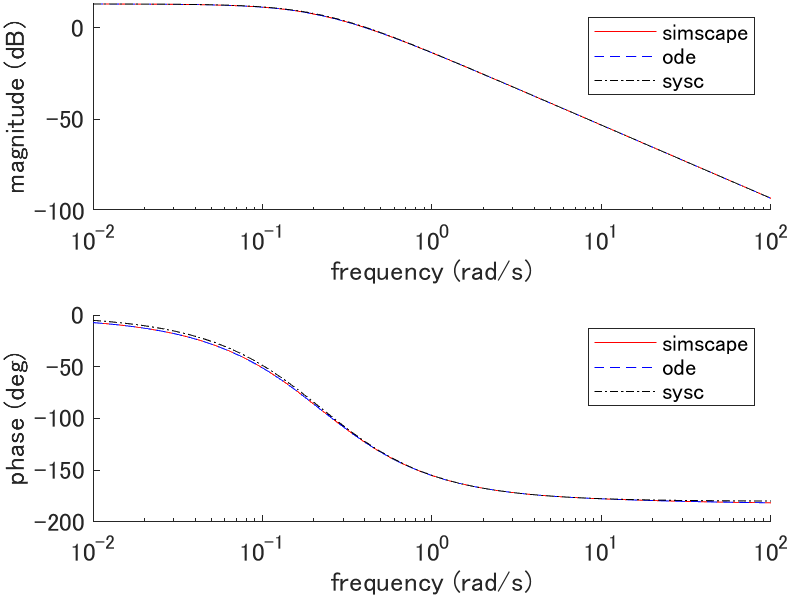

# Water tank (2DOF)

## System equations

```math
\begin{cases}
A_1 \dot{z}_1(t) + a_1 \sqrt{2 g z_1(t)} = q(t) \\
A_2 \dot{z}_2(t) + a_2 \sqrt{2 g z_2(t)} = a_1 \sqrt{2 g z_1(t)}
\end{cases}
```

| Description | Symbol and unit |
|-|-|
| water level | $`z_1, z_2 \mathrm{[m]}`$ |
| volume flow rate of inflow | $`q \mathrm{[m^3/s]}`$ |
| gravitational acceleration | $`g \mathrm{[m/s^2]}`$ |
| cross-sectional area of tank | $`A_1, A_2 \mathrm{[m^2]}`$ |
| cross-sectional area of outflow | $`a_1, a_2 \mathrm{[m^2]}`$ |

## State space equation (plant_ode.m)

```math
\frac{d}{dt} \left[ \begin{array}{c}
z_1(t) \\ z_2(t)
\end{array} \right]
=
\left[ \begin{array}{c}
-\frac{a_1 \sqrt{2 g}}{A_1} \sqrt{z_1(t)} + \frac{1}{A_1} q(t) \\
\frac{a_1 \sqrt{2 g}}{A_2} \sqrt{z_1(t)} - \frac{a_2 \sqrt{2 g}}{A_2} \sqrt{z_2(t)}
\end{array} \right]
=:
f(x(t), u(t))
```

## Linear state space equation (plant_sysc.m)

### Equilibrium point

The equilibrium point satisfies $`f(x_e, u_e) = 0`$ thus,

```math
\begin{cases}
a_1 \sqrt{2 g z_{1e}} = q_e \\
a_1 \sqrt{z_{1e}} = a_2 \sqrt{z_{2e}}
\end{cases}
```

### Linear state space equation

```math
\frac{d}{dt} \left[ \begin{array}{c}
z_1(t) \\ z_2(t)
\end{array} \right]
=
\left[ \begin{array}{cc}
-\frac{a_1}{2 A_1} \sqrt{\frac{2 g}{z_{1e}}} & 0 \\
\frac{a_1}{2 A_1} \sqrt{\frac{2 g}{z_{1e}}} & -\frac{a_2}{2 A_2} \sqrt{\frac{2 g}{z_{2e}}}
\end{array} \right]

\left[ \begin{array}{c}
z_1(t) \\ z_2(t)
\end{array} \right]
+
\left[ \begin{array}{c}
\frac{1}{A_1} \\ 0
\end{array} \right]

\left[ \begin{array}{c}
q(t)
\end{array} \right]
```

## Simscape (plant_simscape.slx)



## Simulation

### Parameters (plant_param.m)

| Parameter | Value |
|-|-|
| $`g \mathrm{[m/s^2]}`$ | $`9.81`$ |
| $`A_1 \mathrm{[m^2]}`$ | $`1.0`$ |
| $`a_1 \mathrm{[m^2]}`$ | $`0.1`$ |
| $`A_2 \mathrm{[m^2]}`$ | $`1.0`$ |
| $`a_2 \mathrm{[m^2]}`$ | $`0.1`$ |

### Initial state response (plot_initial.m)


where $`x(0) = [1.1, 1]^T`$, $`x_e = [1, 1]^T`$, $`u_e = [0.4429]^T`$.

### Impulse response (plot_impulse.m)



where $`x_e = [1, 1]^T`$, $`u_e = [0.4429]^T`$.

### Bode plot (plot_bode.m)



where $`G_1(s) = Z_1(s)/Q(s)`$, $`x_e = [1, 1]^T`$, $`u_e = [0.4429]^T`$.



where $`G_2(s) = Z_2(s)/Q(s)`$, $`x_e = [1, 1]^T`$, $`u_e = [0.4429]^T`$.
